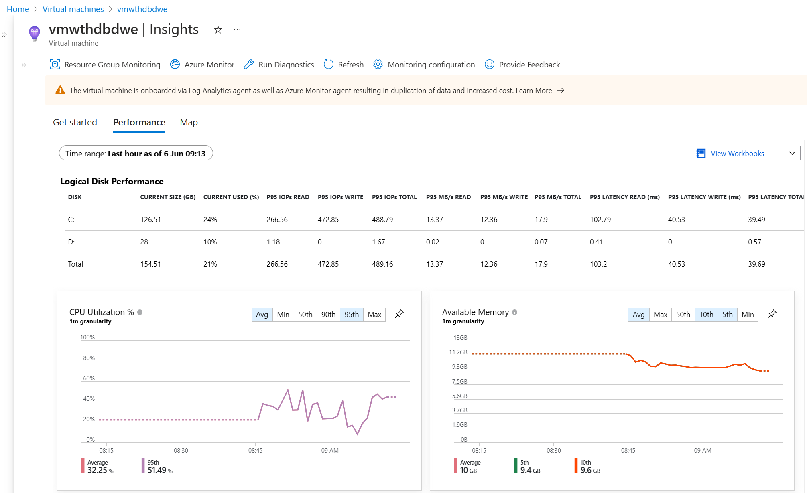
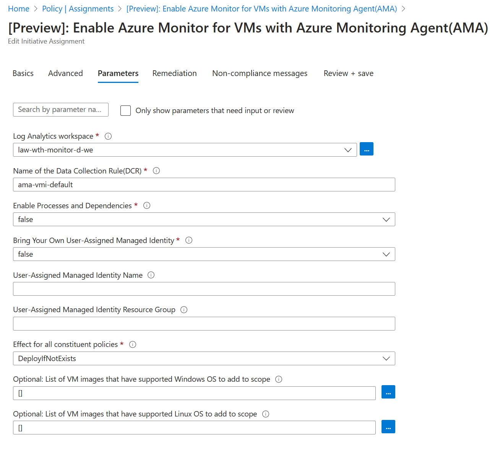
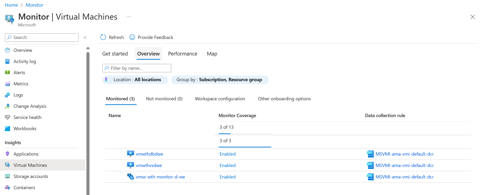

# Challenge 03 - Azure Monitor for Virtual Machines - Coach's Guide 

[< Previous Solution](./Solution-02.md) - **[Home](./README.md)** - [Next Solution >](./Solution-04.md)

## Notes & Guidance

### Enabling VM Insights in Azure Portal

To enable VM insights on an unmonitored virtual machine or Virtual Machine Scale Set using Azure Monitor Agent:

- From the Monitor menu in the Azure portal, select Virtual Machines > Not Monitored.

- Select Enable next to any machine that you want to enable. If a machine is currently running, you must start it to enable it.

- On the Insights Onboarding page, select Enable.

- On the Monitoring configuration page, select Azure Monitor agent and select a data collection rule from the Data collection rule dropdown.

>**Note** Make sure the students select **Azure Monitor agent** here and NOT Log Analytics agent. Make sure the students select the same Log Analytics workspace that they used in previous challenges.

- The Data collection rule dropdown lists only rules configured for VM insights. If a data collection rule hasn't already been created for VM insights, Azure Monitor creates a rule with: Guest performance enabled, Processes and dependencies disabled.

- Select Create new to create a new data collection rule. This lets you select a workspace and specify whether to collect processes and dependencies using the VM insights Map feature.

- Select Configure to start the configuration process. 

The result should look like this:

### (Bonus task) Enable VM insights by using Azure Policy

Use this article for step-by-step instructions:
https://learn.microsoft.com/en-us/azure/azure-monitor/vm/vminsights-enable-policy

Azure Policy lets you set and enforce requirements for all new resources you create and resources you modify. To remediate already existing resources, you need to run a remediation task after resource compliance status is available. Note that this can take from several minutes to a couple of hours, there's no pre-defined expectation of when the compliance evaluation cycle completes. Once the Policy initiative assignment is done, suggest the students to start working on next tasks and revisit this one later.

The students will need to assign 2 Policy inititives to cover both VMs and VMSSs:
- [Preview]: Enable Azure Monitor for VMs with Azure Monitoring Agent(AMA) 
/providers/Microsoft.Authorization/policySetDefinitions/9dffaf29-5905-4145-883c-957eb442c226
- [Preview]: Enable Azure Monitor for VMs with Azure Monitoring Agent(AMA) 
/providers/Microsoft.Authorization/policySetDefinitions/1f9b0c83-b4fa-4585-a686-72b74aeabcfd

Make sure that the students select a single resource group when assigning the Policy inititive (not the full subscription).

When assigning the Policy inititive, suggest the students to deselect the "Only show paraameters that need input or review" to explore the defaut values. Note that the SQL Server VM will be marked as non-compliant if the existing DCR name does not match the name pattern in the Policy.

The overal result after remeditaion should look like this:

