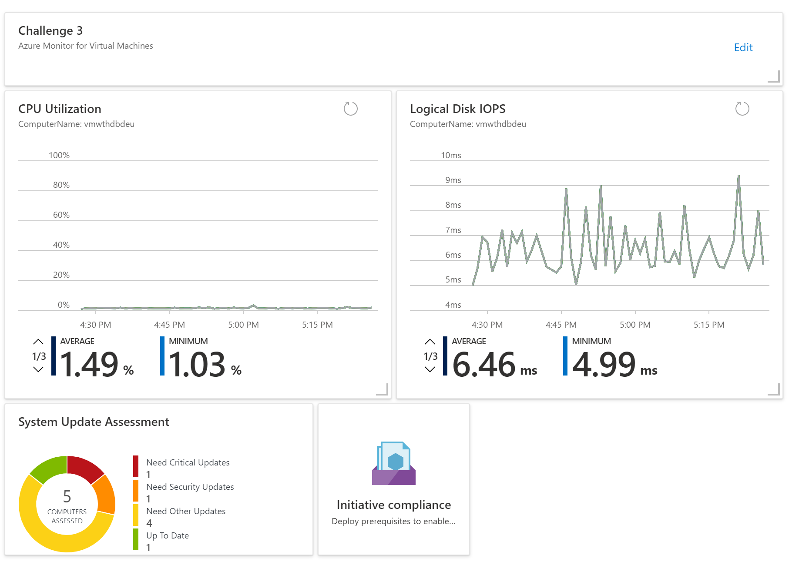

# Challenge 03 - Monitor Virtual Machines with Azure Monitor Agent

[< Previous Challenge](./Challenge-02.md) - **[Home](../README.md)** - [Next Challenge >](./Challenge-04.md)

## Introduction

In this challenge you will put together a comprehensive solution to monitor virtual machine operations. This will include installation of Azure Monitor Agent, exploration of VM Insights, Update Management, and Configuration Management.

Azure Monitor Agent (AMA) collects monitoring data from the guest operating system of Azure and hybrid virtual machines and delivers it to Azure Monitor for use by features, insights, and other services, such as Microsoft Sentinel and Microsoft Defender for Cloud. Azure Monitor Agent replaces the Azure Monitor legacy monitoring agents: Log Analytics Agent, Telegraf agent and (in the future) Diagnostics extention. 

Azure Monitor Agent uses data collection rules, where you define which data you want each agent to collect. Data collection rules let you manage data collection settings at scale and define unique, scoped configurations for subsets of machines. You can define a rule to send data from multiple machines to multiple destinations across regions.

Azure Monitor Agent is implemented as an Azure VM extension. You can install it by using any of these methods:
- As part of the Data collection rule (DCR) creation
- Bicep or ARM Template
- PowerShell
- Azure CLI 
- Azure Policy

## Description

In this challenge you need to complete the following management tasks:
- Install Azure Monitor Agent on all your VMs and VM scale sets. You can use any of the deployment methods from the list above (DCR, Bicep, Azure CLI, etc.). 
>**Hint:** You can find a sample Bicep file, 'ama.bicep', in the '/Challenge-03' subfolder of the Resources folder. Figure out what changes you need to make to use this file.
- Create a Data collection rule and configure it to send basic Windows Event Logs and Performance counters (CPU, Memory, Disk, Network) from your VMs and VM scale sets to the already existing Log Analytics workspace **called...**
- Verify that telemetry started to flow into the Log Analytics workspace.
>**Hint:** You can find sample KQL queries in the '/Challenge-03' subfolder of the Resources folder.
- Configure VM Insights for all VMs, pin Performace graphs from the VM Insights workbook to your Azure dashboard.
- Enable Change Tracking and Inventory for all VMs

## Success Criteria

- Show your dashboard with VM Insights performance graphics, Update Management report, and shortcut to Guest Config policy compliance report.

## Learning Resources

- [Azure Monitor Agent](https://learn.microsoft.com/en-us/azure/azure-monitor/agents/agents-overview)
- [Enable Change Tracking and Inventory using Azure Monitoring Agent](https://learn.microsoft.com/en-us/azure/automation/change-tracking/enable-vms-monitoring-agent?tabs=singlevm)
- [Configure Log Analytics workspace for VM Insights](https://docs.microsoft.com/en-us/azure/azure-monitor/vm/vminsights-configure-workspace?tabs=CLI#add-vminsights-solution-to-workspace)
- [Enable VM insights by using Azure Policy](https://docs.microsoft.com/en-us/azure/azure-monitor/vm/vminsights-enable-policy)
- [Cloud Adoption Framework - Management and Monitoring](https://docs.microsoft.com/en-us/azure/cloud-adoption-framework/ready/enterprise-scale/management-and-monitoring)
- [Azure Monitor Workbooks - Pinning Visualizations](https://docs.microsoft.com/en-us/azure/azure-monitor/visualize/workbooks-overview#pinning-visualizations)

